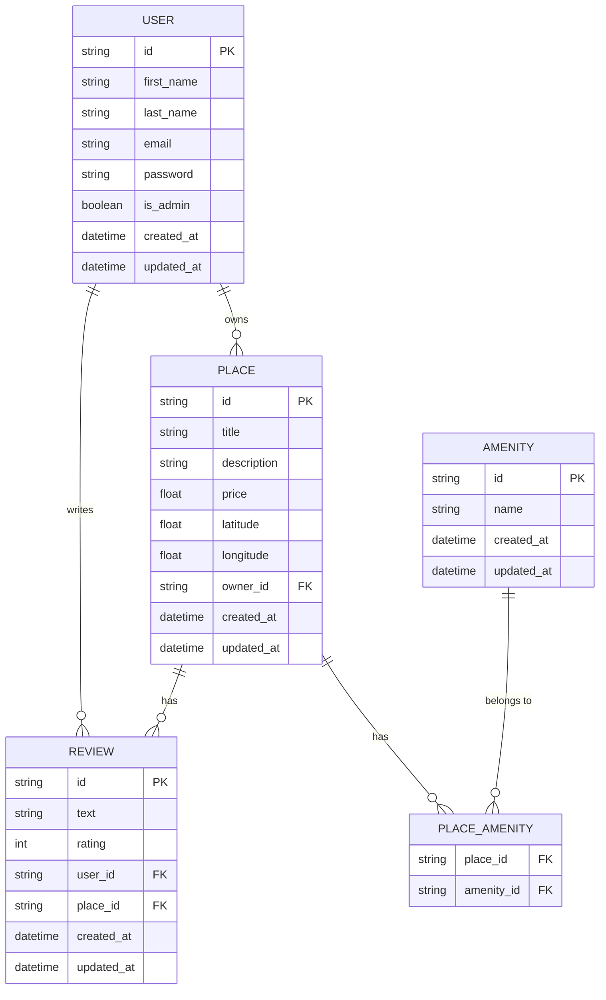

# HBnB Project – Part 3: Enhanced Backend with Authentication and Database Integration

## Overview

Welcome to **Part 3 of the HBnB Project**.
In this stage, the backend of the application is significantly enhanced by introducing **secure authentication**, **authorization**, and **persistent data storage** using a relational database.

The previous parts relied on **in-memory storage**, which is suitable for prototyping but not for real-world applications. In this phase, the backend transitions to **SQLite** for development and prepares the infrastructure for **MySQL** in production.

Additionally, this part introduces **JWT-based authentication** and **role-based access control**, ensuring that the API is secure and that only authorized users can access or modify certain resources.

The goal is to build a backend architecture that is **secure, scalable, and production-ready**.

---

# Project Objectives

The main objectives of this part are:

### 1. Authentication
Implement **JWT (JSON Web Token)** authentication using **Flask-JWT-Extended**.

This allows users to:
- Log in securely
- Receive an authentication token
- Access protected endpoints using the token

### 2. Authorization
Implement **role-based access control (RBAC)** to restrict access to certain actions.

Example:
- Regular users can manage their own resources
- Admin users can manage all resources

This is controlled through the `is_admin` attribute in the `User` model.

### 3. Database Integration
Replace the **in-memory storage system** with a **persistent relational database**.

Development environment:
- **SQLite**

Production environment:
- **MySQL**

### 4. ORM Integration
Use **SQLAlchemy ORM** to map Python classes to database tables.

Entities mapped to the database:
- `User`
- `Place`
- `Review`
- `Amenity`

### 5. Persistent CRUD Operations
All **Create, Read, Update, Delete (CRUD)** operations are refactored to interact directly with the database instead of temporary memory storage.

### 6. Database Design
Design a clear relational schema and visualize it using **Mermaid.js ER diagrams**.

### 7. Data Integrity
Ensure proper validation and constraints:
- Unique fields
- Foreign key relationships
- Required attributes
- Secure password storage

---

# Learning Objectives

By completing this part of the project, you will learn how to:

- Implement **JWT authentication** in a Flask API
- Secure endpoints with **token-based authentication**
- Implement **role-based access control**
- Use **SQLAlchemy ORM** for database abstraction
- Work with **SQLite** for development
- Configure **MySQL** for production environments
- Design **relational database schemas**
- Visualize database relationships using **Mermaid.js**
- Enforce **data validation and integrity constraints**

These skills are essential for building **real-world backend systems**.

---

# Technologies Used

The backend relies on the following technologies:

| Technology | Purpose |
|--------|--------|
| **Python** | Core programming language |
| **Flask** | Web framework |
| **Flask-JWT-Extended** | Authentication with JWT |
| **SQLAlchemy** | ORM for database interactions |
| **SQLite** | Development database |
| **MySQL** | Production database |
| **bcrypt** | Password hashing |
| **Mermaid.js** | Database diagram visualization |

# Diagramme ER

---

# Project Architecture

The project follows a modular backend architecture.
